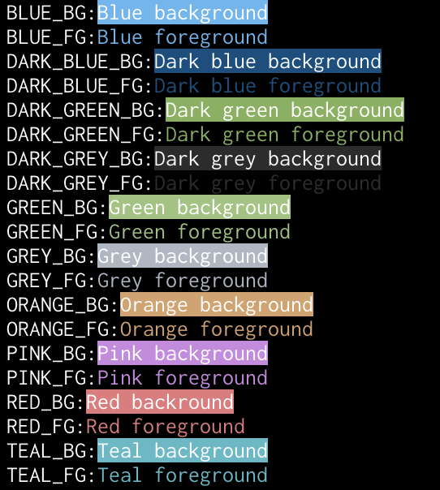

# pastel_colours

A selection of pastel colours for [termion](https://github.com/redox-os/termion).

They look like this:


You can see these in your own terminal by running the example:
```shell
cargo run --example all
```

## History

Developed for us in [lk](https://github.com/jamescoleuk/lk) and [fuzzy_finder](https://github.com/jamescoleuk/fuzzy_finder).